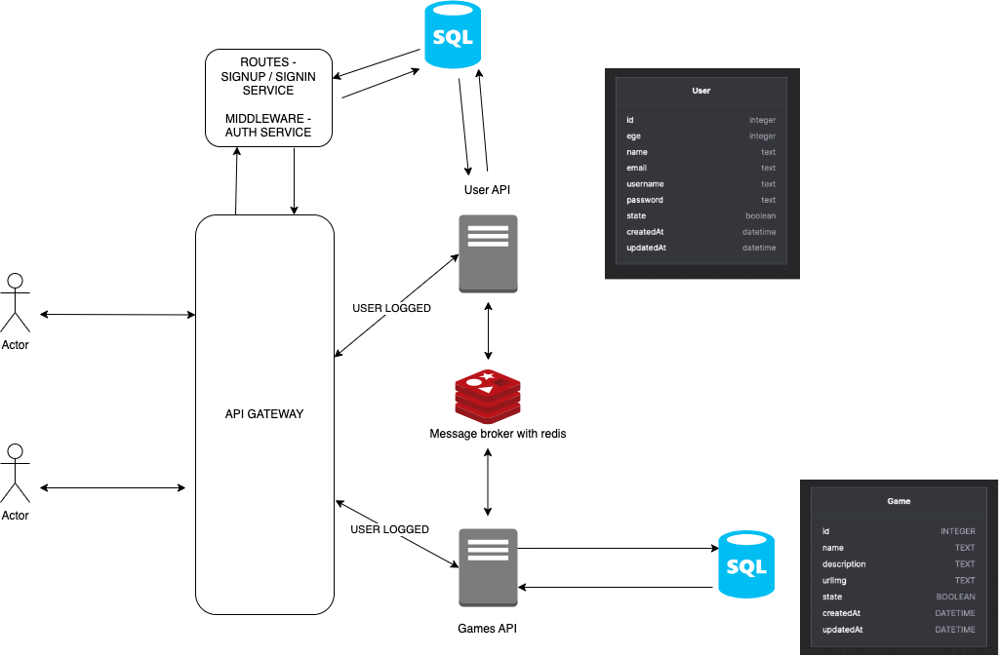
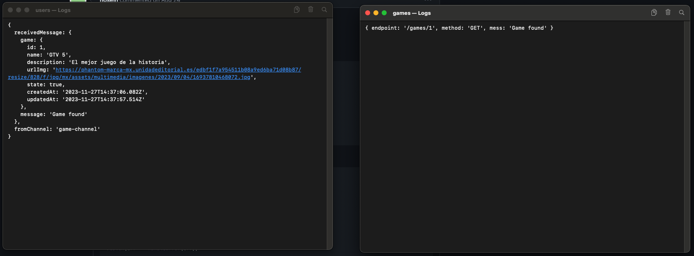
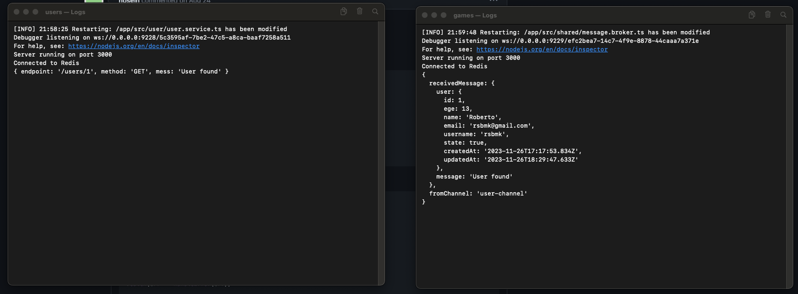

# Users-Games

Descripción breve del proyecto.

## Contenido

- [Introducción](#introducción)
- [Estructura del Proyecto](#estructura-del-proyecto)
- [Requisitos](#requisitos)
- [Configuración](#configuración)
- [Cómo Usar](#cómo-usar)
- [Endpoints](#endpoints)

## Introducción

Bienvenido a Users-Games, una práctica de microservicios utilizando Node.js y Redis. Este proyecto presenta un sistema de gestión de juegos y usuarios, donde dos microservicios independientes se comunican eficientemente a través de un message broker implementado con Redis. Simplificando la puesta en marcha, he contenerizado ambos microservicios con Docker, incluyendo un servicio específico para la base de datos Redis.



## Estructura del Proyecto

El proyecto consta de dos microservicios:

1. **Games:**
    - CRUD para poder gestionar los juegos.
    - Base de datos SQL Lite para almacenar información de juegos.

Ejemplo de mensaje enviado por el microservicio de juegos al microservicio de usuarios:



2. **User:**
    - CURD para poder gestionar los usuarios.
    - Base de datos SQL Lite separada para almacenar información de usuarios.

Ejemplo de mensaje enviado por el microservicio de usuarios al microservicio de juegos:



La arquitectura del código sigue un enfoque de capas para mantener un código limpio y organizado.

## Cómo Usar
Para inicializar el proyecto solo es necesario tener docker y configurar las `env` en ambos servios.

En el archivo `.env.example` estan las variables de entorno que se deben configurar para cada servicio. Y los valores que deben tener.

```bash
# .env.example
PORT=3000
NODE_ENV=development
DATABASE_URL="file:./dev.db"
REDIS_HOST=redis.users-games.orb.local

```
Una vez configuradas las variables de entorno, se debe renombrar el archivo `.env.example` a `.env` y ejecutar el siguiente comando:

```bash
# Levantar los contenedores
$ docker-compose up -d
```

Con esto, los microservicios estarán disponibles en los siguientes puertos:

- **Users:** http://localhost:3001
- **Games:** http://localhost:3002

## Endpoints
En el archivo `Insomnia_endpoints.json` se encuentran los endpoints disponibles para cada microservicio, listos para importar en Insomnia.